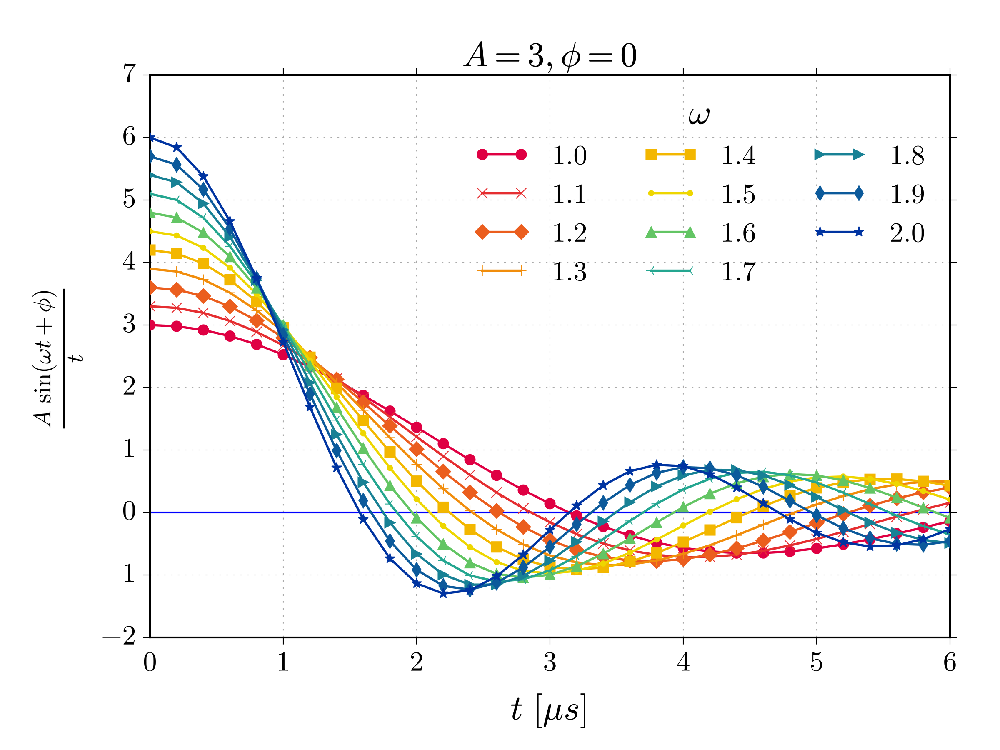

# XYZPY

[](https://travis-ci.org/jcmgray/xyzpy)
[](https://codeclimate.com/github/jcmgray/xyzpy/coverage)

`xyzpy` is a small pure python library for easily generating, managing and plotting large parameter space data, of the type that often occurs in numerical simulations.

### Generate
  - Automatically run all combinations of specified parameters, or e.g. only those cases which are missing.
  - Perform the runs in any number of parallel processes.
  - Display nested progress and estimated completion time (using [`tqdm`](<https://github.com/tqdm/tqdm>)).
  - Allow output of any number of multi-dimensional variables, storing the result in a self-describing [`xarray`](<https://github.com/pydata/xarray>) Dataset.
  - (*Planned*) [Telegram](https://telegram.org/) notifications when a run is complete.
  - (*Planned*) Detailed logging of every run's parameters.

### Manage & Plot
  - Combine, save & load datasets on all platforms (using `xarray` and the netcdf format).
  - Plot data using names rather than remembering axes etc.
    - Use [`bokeh`](https://github.com/bokeh/bokeh) for interactive plotting.
    - Use [`matplotlib`](https://github.com/matplotlib/matplotlib) for creating complex high quality figures...
    - ... but share a common interface between them as much as possible.


## Installation
The easiest method of installing `xyzpy`'s dependencies is via [`conda`](http://conda.pydata.org/miniconda.html) and [`conda-forge`](https://conda-forge.github.io/):
```bash
$ conda install numpy xarray h5py matplotlib bokeh
$ conda config --append channels conda-forge
$ conda install h5netcdf tqdm 
```
After which this repo can be directly installed using `pip`.

## Example
```python
In [1]: import xyzpy as xyz

In [2]: import numpy as np

In [3]: from time import sleep
```
Declare a mock function which we want to run with lots of different parameters.
```python
In [4]: def foo(amp, freq, phase, t):
   ...:     xs = amp * np.sin(freq * t - phase) / t
   ...:     finish_positive = xs[-1] > 0
   ...:     sleep(1)
   ...:     return xs, finish_positive
   ...:

In [5]: foo(1, 2, 3, np.linspace(0.1, 0.2, 3))
Out[5]: (array([-3.3498815 , -2.8491992 , -2.57750686]), False)
```
Now set up all the parameters, names of variables and runner settings:
```python
In [6]: ts = np.linspace(0.0001, 6, 31)

In [7]: settings = {
   ...:     # The function to run, for parallel execution it needs to be importable
   ...:     'fn': foo,
   ...:     # Run the combination (outer product) of all these parameters:
   ...:     'combos': {
   ...:         'amp': [1, 2, 3],
   ...:         'freq': np.linspace(1, 2, 11),
   ...:         'phase': [0],
   ...:     },
   ...:     'constants': {
   ...:         't': ts
   ...:     },
   ...:     # Name the outputs from function as such:
   ...:     'var_names': ['x', 'finish_positive'],
   ...:     # Specify the names of each output's 'internal' dimensions
   ...:     'var_dims': [['t'], []],
   ...:     # Specify the actual coordinates for these dimensions
   ...:     'var_coords': {'t': ts},
   ...:     # Show 2 nested progress bars
   ...:     'progbars': 2,
   ...:     # Put other miscellenous details here
   ...:     'attrs': {'hello': 'world'}
   ...: }
```
Begin the runs:
```python
In [8]: ds = xyz.combo_runner_to_ds(**settings)
freq: 100%|#####################################| 11/11 [00:33<00:00,  3.01s/it]
amp: 100%|########################################| 3/3 [00:03<00:00,  1.00s/it]

In [9]: ds
Out[9]:
<xarray.Dataset>
Dimensions:          (amp: 3, freq: 11, phase: 1, t: 31)
Coordinates:
  * freq             (freq) float64 1.0 1.1 1.2 1.3 1.4 1.5 1.6 1.7 1.8 1.9 2.0
  * amp              (amp) int32 1 2 3
  * t                (t) float64 0.0001 0.2001 0.4001 0.6001 0.8001 1.0 1.2 ...
  * phase            (phase) int32 0
Data variables:
    x                (freq, amp, phase, t) float64 1.0 0.9933 0.9735 0.9411 ...
    finish_positive  (freq, amp, phase) bool False False False True True ...
Attributes:
    hello: world
```
Finally plot some of the data:
```python
In [10]: plt1 = xyz.lineplot(ds.loc[{'amp': 3}],
    ...:                     # plot 'x' as a function of 't' for varying 'freq'
    ...:                     'x', 't', 'freq',  
    ...:                     colors=True, colormap='xyz',
    ...:                     legend=True, legend_ncol=3,
    ...:                     title=r'$A=3, \phi=0$',
    ...:                     xlabel=r"$t\ [\mu s]$",
    ...:                     ylims=(-2, 7),
    ...:                     ylabel=r"$\frac{A\ \sin(\omega t + \phi)}{t}$",
    ...:                     zlabel=r'$\omega$',
    ...:                     font='CMU Serif',
    ...:                     fontsize_legend=16,
    ...:                     hlines=[0])

```

