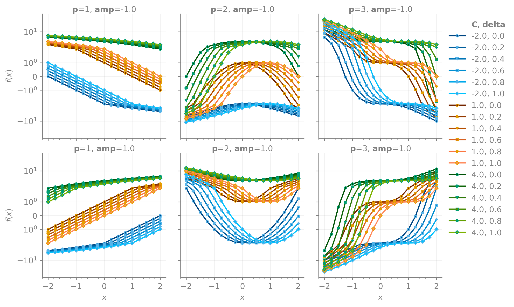

[](https://github.com/jcmgray/xyzpy/actions/workflows/tests.yml)
[](https://codecov.io/gh/jcmgray/xyzpy)
[](https://xyzpy.readthedocs.io)
[](https://pypi.org/project/xyzpy/)
[](https://anaconda.org/conda-forge/xyzpy)
[](https://pixi.sh)

-------------------------------------------------------------------------------

[`xyzpy`](https://github.com/jcmgray/xyzpy) is python library for efficiently
generating, manipulating and plotting data with a lot of dimensions, of the
type that often occurs in numerical simulations. It stands wholly atop the
labelled N-dimensional array library [`xarray`](http://xarray.pydata.org). The
project's documentation is hosted on [readthedocs](http://xyzpy.readthedocs.io).

The aim is to take the pain and errors out of generating and exploring data
with a high number of possible parameters. This means:

- you don't have to write super nested for loops
- you don't have to remember which arrays/dimensions belong to which variables/parameters
- you don't have to parallelize over or distribute runs yourself
- you don't have to worry about loading, saving and merging disjoint data
- you don't have to guess when a set of runs is going to finish
- you don't have to write batch submission scripts or leave the notebook to use SLURM, PBS or SGE
- you don't have to lose progress if your run is interrupted
- you don't have to fiddle with `CUDA_VISIBLE_DEVICES` or `taskset` to assign GPU devices or CPU cores to different runs

To this data generation functionality, ``xyzpy`` adds a simple plotting
interface accessed via [`ds.xyz.plot()`](https://xyzpy.readthedocs.io/en/latest/autoapi/xyzpy/plot/infiniplot/index.html#xyzpy.plot.infiniplot.infiniplot)
that automatically maps dataset dimensions to visual elements including color,
marker, marker size, line style, line width, subplot rows and columns, and text
annotations. It also adds various other utilities for timing and tracking
memory usage, and for visualizing matrices and high dimensional tensors.

## Quick-start

Here's a simple example of generating and plotting a 5D function that uses the
high level driver [`xyz.cultivate()`](https://xyzpy.readthedocs.io/en/latest/autoapi/xyzpy/index.html#xyzpy.cultivate)
to handle a full cycle of data generation:

```python
import xyzpy as xyz

def foo(x, delta, p, amp=1.0, C=0.0):
    return {"fx": amp * (x - delta) ** p + C}

# cultivate!
# 0. annotate the function
# 1. write missing parameters combinations to disk ('sow')
# 2. compute those, with results stored persistenly to disk ('grow')
# 3. load results into a xarray.Dataset, merging with existing ('reap')
ds = xyz.cultivate(
    foo,
    # this specifies we'll return a dict of named data_vars ourselves
    var_names=None,
    # this specifies we'll harvest results to the file "foo.h5"
    data_name="foo.h5",
    # compute the outer product of these parameter combinations
    combos=dict(
        x=[-2 + i * 0.25 for i in range(17)],
        p=[1, 2, 3],
        delta=[0.0, 0.2, 0.4, 0.6, 0.8, 1.0],
        C=[-2.0, 1.0, 4.0],
        amp=[-1.0, 1.0],
    ),
)

# plot!
# - we can map pretty much any coordinate to any visual property
# - we can map to a palette ("hue") as well as position within that ("color")
fig, axs = ds.xyz.plot(
    x="x",
    y="fx",
    yscale="symlog",
    ylabel="$f(x)$",
    hue="C",
    markeredgecolor="C",
    color="delta",
    marker="delta",
    col="p",
    row="amp",
    markersize=3,
)

# clean up!
# - if we didn't delete the dataset, next run will only compute missing data
!rm foo.h5
```




Please see the [docs](http://xyzpy.readthedocs.io) for more information.

