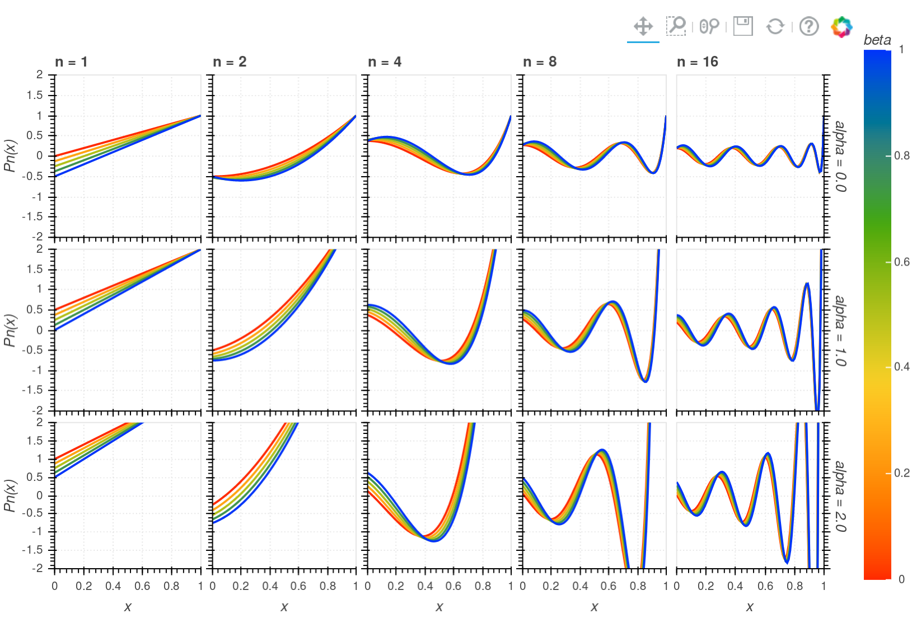

.. raw:: html

    

.. image:: https://travis-ci.org/jcmgray/xyzpy.svg?branch=master
  :target: https://travis-ci.org/jcmgray/xyzpy
.. image:: https://codecov.io/gh/jcmgray/xyzpy/branch/master/graph/badge.svg
  :target: https://codecov.io/gh/jcmgray/xyzpy
.. image:: https://api.codacy.com/project/badge/Grade/7085feb3f47c4c509559778be5eb6a60
  :target: https://www.codacy.com/app/jcmgray/xyzpy?utm_source=github.com&amp;utm_medium=referral&amp;utm_content=jcmgray/xyzpy&amp;utm_campaign=Badge_Grade
.. image:: https://landscape.io/github/jcmgray/xyzpy/master/landscape.svg?style=flat
  :target: https://landscape.io/github/jcmgray/xyzpy/master
  :alt: Code Health
.. image:: https://readthedocs.org/projects/xyzpy/badge/?version=latest
  :target: http://xyzpy.readthedocs.io/en/latest/?badge=latest
  :alt: Documentation Status

----------------------------------------------------------------------------------

`xyzpy <https://github.com/jcmgray/xyzpy>`__ is python library for efficiently generating, manipulating and plotting data with a lot of dimensions, of the type that often occurs in numerical simulations. It stands wholly atop the labelled N-dimensional array library `xarray <http://xarray.pydata.org/en/stable/>`__. The project's documentation is hosted on `readthedocs <http://xyzpy.readthedocs.io/>`__.

The aim is to take the pain and errors out of generating and exploring data with a high number of possible parameters. This means:

- you don't have to write super nested for loops
- you don't have to remember which arrays/dimensions belong to which variables/parameters
- you don't have to parallelize over or distribute runs yourself
- you don't have to worry about loading, saving and merging disjoint data
- you don't need to guess when a set of runs is going to finish

As well as the ability to automatically parallelize over runs, ``xyzpy`` provides the ``Crop`` object that allows runs and results to be written to disk, these can then be run by any process with access to the files - e.g. a batch system - or just serve as a convenient persistent progress mechanism.

In terms of post-processing, as well as all the power of `xarray <http://xarray.pydata.org/en/stable/>`__, ``xyzpy`` adds uneven step differentiation and error propagation, filtering and interpolation - along any axis just specified by name.

The aim of the plotting functionality is to keep the same interface between interactively plotting the data using `bokeh <https://bokeh.pydata.org/en/latest/>`__, and static, publication ready figures using `matplotlib <https://matplotlib.org/>`__, whilst being able to see the dependence on up to 4 dimensions at once.

Please see the `docs <http://xyzpy.readthedocs.io/>`__ for more information.

