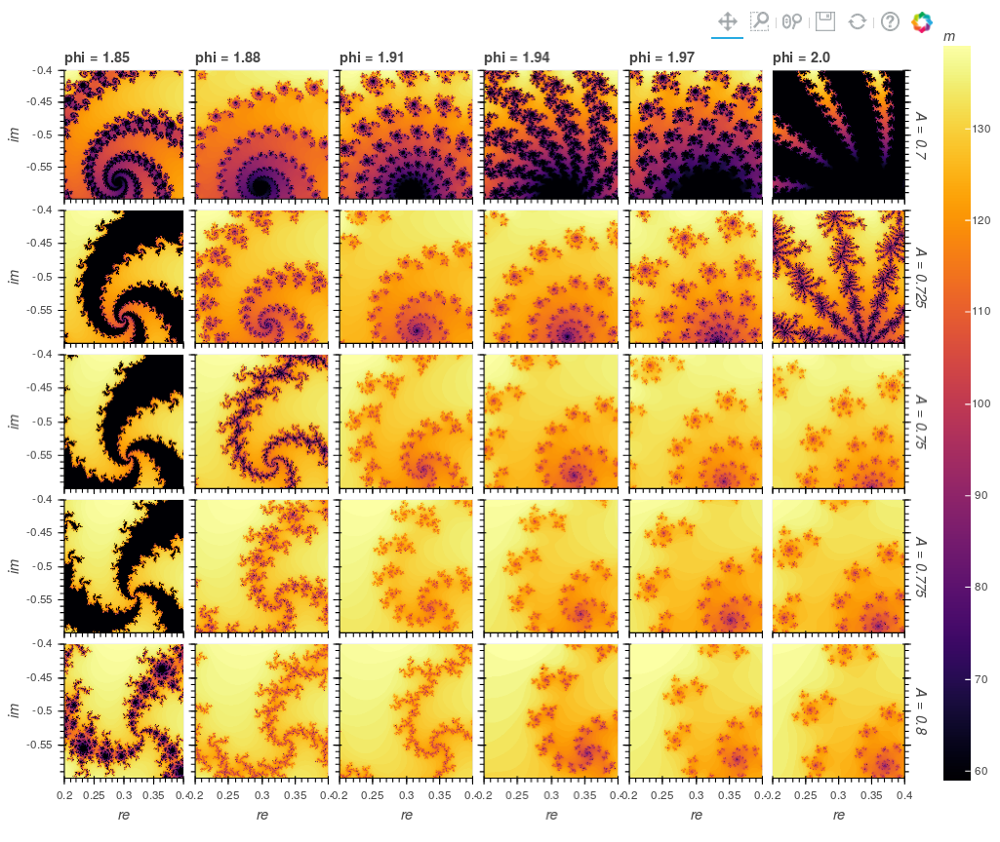
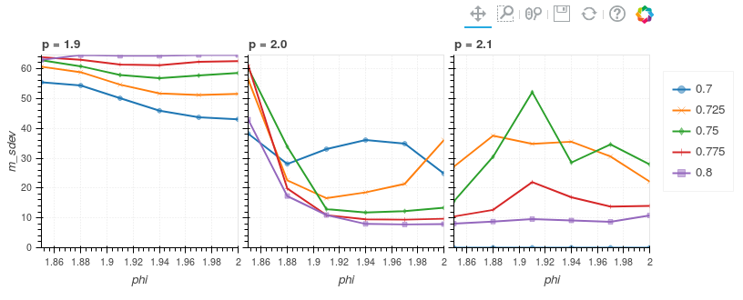

Structured Output with Julia Set Example
========================================

This example shows how to describe 'structured' output data for a :class:`~xyzpy.Runner`, that is, output data can have its own internal dimensions.

Let's start by defining the Julia set equation with 3 extra modifications (``p``, ``A`` and ``phi``) we want to explore:

.. code-block:: python

    from xyzpy import *
    import numba as nb
    import numpy as np
    from cmath import exp, pi

    @nb.vectorize(nopython=True)
    def _mandel(z0, p, A, phi, limit):
        z = z0
        while abs(z) < 2:
            limit -= 1
            z = z**p + A * exp(1.0j * phi)
            if limit<0:
                return 0
        return limit

    def mandel(z0, p=2, A=0.7, phi=1.885, limit=100):
        m = _mandel(z0, p, A, phi, limit)
        return m, np.std(m)

Since it is explicitly vectorized, ``mandel`` takes an array of complex numbers ``z0``, and returns
how many iterations, ``m``, each value takes to diverge (or not). We are also interested in the standard deviation of the results so we return that as well.

Let's set up some constants including the array of complex numbers we want to supply:

.. code-block:: python

    res = 256
    L = 150
    re_lims, im_lims = (0.2, 0.4), (-0.4, -0.6)
    r = np.linspace(*re_lims, res)
    i = np.linspace(*im_lims, res)
    zs = r.reshape(-1, 1) + 1.0j * i.reshape(1, -1)  # turn into grid

Now we can describe the function with a :class:`~xyzpy.Runner`:

.. code-block:: python

    runner = Runner(
        mandel,                         # The function
        var_names=['m', 'm_sdev'],      # The names of its output variables
        var_dims={'m': ['re', 'im']},   # The name of the internal dimensions of 'm'
        var_coords={'re': r, 'im': i},  # the coordinates of those dimensions
        constants={'limit': L},         # supply L as a constant
        resources={'z0': zs},           # supply z0 as a constant, but don't record it
    )

Now let's define the parameter space we are interested in:

.. code-block:: python

    combos = {
        'p': np.linspace(1.9, 2.1, 3),
        'A': np.linspace(0.7, 0.8, 5),
        'phi': np.linspace(1.85, 2, 6)
    }

We will thus get 5 dimensions in total: the 3 parameters in ``combos``, and the two internal dimensions ``re`` and ``im``.

Since each run might be quite slow, let's also parallelize over the runs:

.. code-block:: python

    >>> runner.run_combos(combos, parallel=True)
    100%|##########| 90/90 [00:12<00:00,  6.96it/s]
    <xarray.Dataset>
    Dimensions:  (A: 5, im: 256, p: 3, phi: 6, re: 256)
    Coordinates:
      * p        (p) float64 1.9 2.0 2.1
      * A        (A) float64 0.7 0.725 0.75 0.775 0.8
      * phi      (phi) float64 1.85 1.88 1.91 1.94 1.97 2.0
      * re       (re) float64 0.2 0.2008 0.2016 0.2024 0.2031 0.2039 0.2047 ...
      * im       (im) float64 -0.4 -0.4008 -0.4016 -0.4024 -0.4031 -0.4039 ...
    Data variables:
        m        (p, A, phi, re, im) int64 0 0 0 0 0 0 0 0 0 0 0 0 0 0 0 0 0 0 0 ...
        m_sdev   (p, A, phi) float64 55.42 54.35 50.1 45.92 43.69 43.03 60.65 ...
    Attributes:
        limit:    150

Now let's plot the main variable 'm'. Since we can only plot 4 dimensions at once we have to select a value for one dimension first:

.. code-block:: python

    ds = runner.last_ds.sel(p=2.0)
    ds.xyz.iheatmap(x='re', y='im', z='m', col='phi', row='A')

We output multiple variables so we can also plot the quantity ``m_sdev``:

.. code-block:: python

    runner.last_ds.xyz.ilineplot(x='phi', y='m_sdev', z='A', col='p')

